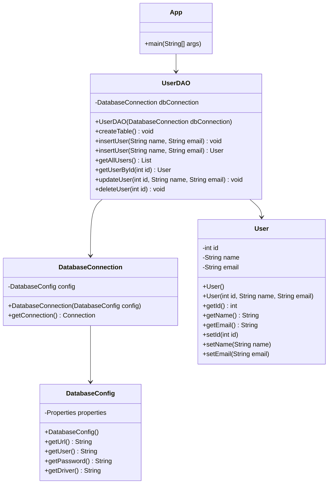

# JDBC H2 Datenbank Beispiel

Dieses Projekt demonstriert eine einfache Java-Anwendung, die JDBC verwendet, um mit einer H2-In-Memory-Datenbank zu interagieren.

## Projektstruktur

- `pom.xml`: Maven-Projektkonfiguration, einschließlich H2-Datenbank- und JUnit-Abhängigkeiten.
- `src/main/resources/db.properties`: Konfigurationsdatei für die Datenbankverbindung (URL, Benutzer, Passwort).
- `src/main/java/com/example/jdbc/DatabaseConfig.java`: Hilfsklasse zum Laden der Datenbankkonfiguration aus `db.properties`.
- `src/main/java/com/example/jdbc/DatabaseConnection.java`: Verwalten der Datenbankverbindung.
- `src/main/java/com/example/jdbc/User.java`: POJO (Plain Old Java Object), das die Benutzerentität darstellt.
- `src/main/java/com/example/jdbc/UserDAO.java`: Data Access Object für CRUD-Operationen auf der Tabelle `users`.
- `src/main/java/com/example/jdbc/App.java`: Hauptanwendungsklasse, die die Verwendung von `UserDAO` demonstriert.

## Ausführung

1. **Projekt kompilieren:**
   ```bash
   mvn clean compile
   ```

2. **Anwendung ausführen:**
   ```bash
   mvn exec:java
   ```

   Dies führt die Klasse `App.java` aus, die folgende Aktionen durchführt:
   - Erstellen der Tabelle `users`.
   - Einfügen von Beispiel-Benutzerdaten.
   - Lesen aller Benutzer.
   - Lesen eines Benutzers nach ID.
   - Aktualisieren eines Benutzers.
   - Löschen eines Benutzers.
   - Anzeigen der endgültigen Benutzerliste.

## Datenbankdetails

- **Typ**: H2-In-Memory-Datenbank.
- **Verbindungs-URL**: `jdbc:h2:mem:testdb;DB_CLOSE_DELAY=-1` (konfiguriert in `db.properties`).
  Der Parameter `DB_CLOSE_DELAY=-1` stellt sicher, dass die In-Memory-Datenbank so lange geöffnet bleibt, wie die JVM aktiv ist, um Datenverluste zwischen Verbindungen innerhalb desselben Anwendungsdurchlaufs zu verhindern.

## Klassendiagramm

Das folgende Klassendiagramm veranschaulicht die Struktur der Anwendung:



Dieses Diagramm bietet einen Überblick über die Beziehungen zwischen den Hauptklassen im Projekt.

